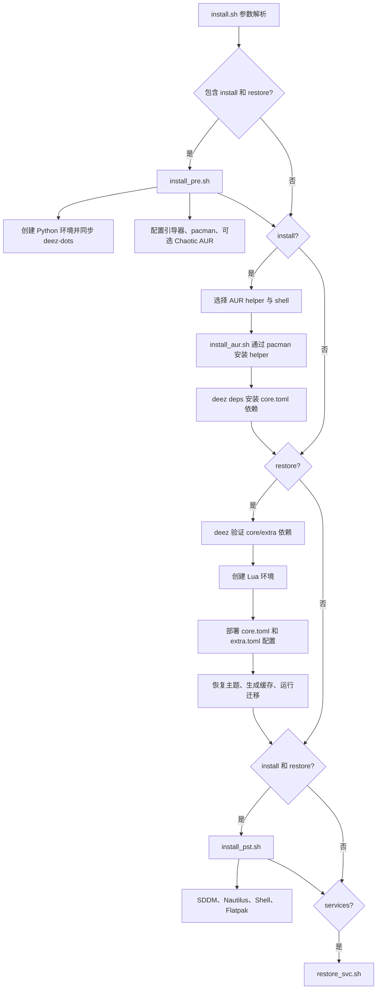

# HyDE 安装、恢复与本仓库定制说明

基准版本：HyDE `v26.7.4`（上游提交 `8fa0073e`）

本文说明当前 `Scripts/install.sh` 的实际执行路径，以及本仓库在上游 Lua/deez-dots 架构上的定制。旧的 `pkg_core.lst`、`restore_cfg.lst` 和 `restore_cfg.psv` 仍为兼容工具保留，但不再是主安装流程的数据源。

## 1. 常用命令

```bash
cd Scripts

./install.sh             # 完整安装：install + restore + services
./install.sh -i          # 只安装依赖
./install.sh -r          # 只验证依赖、部署配置、运行迁移
./install.sh -s          # 只启用服务
./install.sh -p          # 只初始化 Python/deez-dots 环境
./install.sh -t          # 完整流程 dry-run
./install.sh -irsn       # 完整安装，但跳过 NVIDIA 动作
./install.sh --help      # 查看帮助
```

其他选项：

| 参数 | 行为 |
| --- | --- |
| `-d`, `--defaults` | 安装依赖并向包管理器传入 `--noconfirm` |
| `-h`, `--shell` | 重新评估 shell 配置 |
| `-m`, `--no-theme` | 跳过主题安装 |
| `-n`, `--no-nvidia` | 跳过 NVIDIA 驱动和引导参数处理 |

如果恢复阶段提示找不到 `deez-dots`，先执行 `./install.sh -p`，然后重试 `./install.sh -r`。

## 2. 当前安装流程



### 2.1 主数据源

| 用途 | 当前数据源 |
| --- | --- |
| 核心依赖和配置 | `Scripts/dots-groups/core.toml` |
| 额外依赖和配置 | `Scripts/dots-groups/extra.toml` |
| 基础软件包 | `Scripts/dots/deps.toml` |
| 单个组件的依赖/文件策略 | `Scripts/dots/*.toml` |
| 完整 deez-dots manifest | `dots.toml` |
| Flatpak 应用 | `Scripts/extra/custom_flat.lst` |
| systemd 服务 | `Scripts/restore_svc.lst` |
| 主题 | `Scripts/themepatcher.lst` |
| 版本迁移 | `Scripts/migrations/*.sh` |

`Scripts/pkg_core.lst` 只供旧的 `install_pkg.sh`、卸载和兼容流程使用。`Scripts/restore_cfg.lst` 与 `Scripts/restore_cfg.psv` 只供旧的独立恢复脚本使用。修改新安装效果时，必须同步修改 TOML，而不能只改这些 legacy 文件。

### 2.2 deez-dots 文件动作

| 动作 | 含义 |
| --- | --- |
| `sync` | 目标按仓库版本同步，更新时可以覆盖 |
| `preserve` | 目标不存在时部署，已有用户配置保持不动 |
| `tarball` | 从归档资源部署 |

本仓库将用户可编辑的 `.zshrc`、`.zshenv`、`hypridle.conf` 和 `hyprland.lua` 设为 `preserve`；HyDE 自身的 Lua 模块、命令和共享资源使用 `sync`。

## 3. Hyprland Lua 配置

HyDE 已不再读取旧的 Hyprland `.conf` 配置。入口和用户配置分别是：

| 类型 | 路径 | 更新策略 |
| --- | --- | --- |
| HyDE 入口 | `~/.local/share/hypr/hyde.lua` | `sync` |
| HyDE Lua 模块 | `~/.local/share/hypr/lua/` | `sync` |
| 用户配置 | `~/.config/hypr/hyprland.lua` | `preserve` |

旧的 `nvidia.conf`、`userprefs.conf`、`keybindings.conf`、`windowrules.conf`、`monitors.conf`、animations/workflows 配置不会再被读取。自定义设置应写成 Lua；详细迁移方式见 `MIGRATION-LUA.md`。

本仓库原来在 `nvidia.conf` 中启用的：

```text
env = NVD_BACKEND,direct
```

已经迁移到 `Configs/.local/share/hypr/lua/env.lua` 的 NVIDIA 检测分支：只有 NVIDIA 驱动正常工作时才设置 `NVD_BACKEND=direct`。

## 4. 本仓库的默认软件和桌面行为

### 4.1 软件包差异

相对上游默认安装，本仓库：

- 安装 `nautilus`，不默认安装 `dolphin`。
- 安装 `file-roller`，不默认安装 `ark`。
- 安装 `noto-fonts-cjk`。
- 不安装 Dolphin 专用的 `qt5-imageformats`、`ffmpegthumbs` 和 `kde-cli-tools`。
- 默认只部署 Zsh，不安装 Fish。
- 不为一份 Wayland flags 配置额外安装 Electron；需要时可单独使用 `Scripts/dots/electron.toml` 部署。
- 不在默认完整 manifest 中安装或部署 Code、Baloo、Dolphin 配置；Code 仍可通过 optional manifest 单独安装。

这些选择同时维护在 `Scripts/dots/deps.toml` 和 legacy `Scripts/pkg_core.lst` 中。默认 deez 部署组也不会包含 `dolphin.toml` 与 `baloofilerc.toml`。

### 4.2 默认文件管理器

完整安装的后置步骤会执行：

```bash
xdg-mime default org.gnome.Nautilus.desktop inode/directory
```

这段逻辑位于 `Scripts/install_pst.sh`。只运行 `./install.sh -r` 不会执行后置步骤；新安装使用无参数完整流程即可。

### 4.3 AUR helper

`Scripts/install_aur.sh` 不从 AUR clone 后执行 `makepkg`，而是通过 pacman 安装所选的 `yay-bin`/`paru-bin` 等 helper。因此首次完整安装应在 `install_pre.sh` 的提示中启用 Chaotic AUR，或者预先配置一个包含所选 helper 的 pacman 仓库。

### 4.4 用户配置默认值

- `.zshrc` 默认编辑器为 `nano`。
- `.zshenv` 更新策略为 `preserve`。
- `hypridle.conf`：30 分钟调暗、6 小时锁屏、6 小时 10 分关闭显示器、2 天后挂起。
- Flatpak 清单已移除 WebCord、图形创作、OBS、Clapper、VideoDownloader 等非必需应用。
- `restore_app.sh` 不再导入或修改 Firefox profile。

## 5. 新安装

```bash
git clone <本仓库地址> ~/HyDE
cd ~/HyDE/Scripts
./install.sh
```

安装时建议：

1. 允许配置 Chaotic AUR，使 pacman 可以安装选定的 AUR helper。
2. 使用默认完整流程，让依赖、配置、后置文件管理器设置和服务一次完成。
3. 安装完成后重启，再通过 `hyprctl configerrors` 检查 Hyprland。

## 6. 从旧版更新

```bash
cd ~/HyDE
git pull
cd Scripts
./install.sh -r
```

更新到 Lua 版本时需注意：

- 旧 `.conf` 文件不会自动转换为 Lua；有自定义内容时按 `MIGRATION-LUA.md` 手工迁移。
- 已消失的旧 shell helper 会由 `v26.7.4` 迁移脚本移动到 `~/.local/state/hyde/migration/v26.7.4/`。
- 如果旧的 `hyde-config.service` 或 `hyde-ipc.service` 已启用，应按迁移文档停用。
- 旧 zsh/fish completion 可能遮蔽新版 completion，应按迁移文档清理。

## 7. 验证

仓库提供以下检查：

```bash
./tests/run.sh
cd Scripts && ./install.sh -t
```

其中测试会检查 Bash/Lua 语法、TOML dot manifests、路径引用、迁移脚本、快捷键和截图 wrapper。

> 上游 `v26.7.4` 的 `install.sh -t` 仍会执行迁移和部分后置操作，不应把它当作完全无副作用的沙箱。运行前应确认用户配置已有备份。
